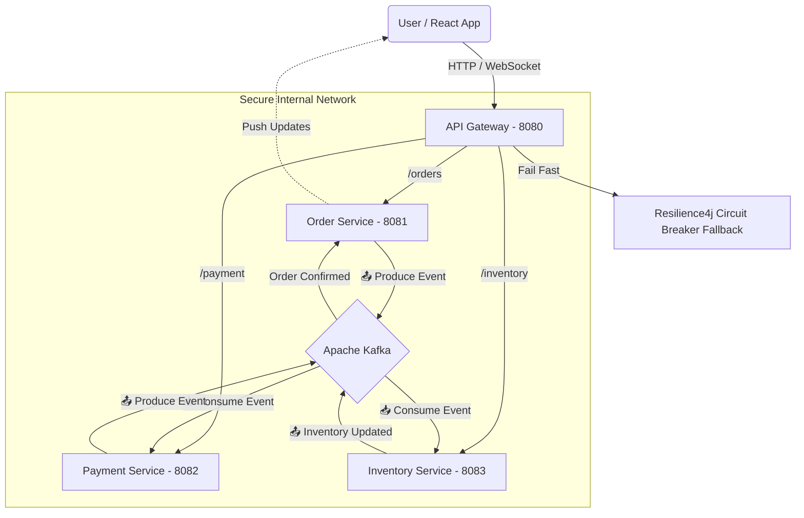

# 🍔 FoodFlow — Distributed Event-Driven Food Delivery System


> A high-performance **microservices ecosystem** simulating a real-time food delivery platform with distributed event orchestration, circuit breakers, and WebSocket-powered live updates.

---

## 🏗️ System Architecture


## 🚀 Key Features

- ⚡ **Event-Driven Architecture** — Kafka decouples services for massive scalability.
- 🔄 **Real-Time Bi-Directional Updates** — WebSockets deliver sub-50ms order tracking.
- 🛡 **Circuit Breakers & Fallbacks** — Resilience4j ensures fault tolerance.
- 💳 **Distributed Transactions (Saga Pattern)** — Handles success + compensating flows.
- 🌐 **API Gateway Abstraction** — Frontend interacts only via port `8080`.
- 🔍 **Observability** — Micrometer + Zipkin for distributed tracing.

---

## 💡 Saga Lifecycle

Success Path: Order Placed → Wallet Deducted → Inventory Reserved → Order Confirmed
Failure Path: Order Placed → Insufficient Funds → Compensating Event → Order Cancelled


---

## 🛠️ Tech Stack

| Component | Technology |
|----------|------------|
| Backend | Java 17, Spring Boot 3.3 |
| Frontend | React.js, Redux Toolkit, Tailwind CSS, Vite |
| Message Broker | Apache Kafka (KRaft Mode) |
| Database | PostgreSQL |
| API Gateway | Spring Cloud Gateway |
| Real-Time | Spring WebSocket (STOMP), SockJS |
| Resilience | Resilience4j |
| Observability | Micrometer, Zipkin |
| Containerization | Docker, Docker Compose |

---

## 📸 Screenshots

| Screenshot | Example |
|-----------|---------|


---

## 🏃 Getting Started Locally

### 📌 Prerequisites
- Java 17+
- Node.js & npm
- Docker Desktop running

---

### 1️⃣ Clone Repository
```bash
git clone https://github.com/Pavan-solanki/FoodFlow.git
cd FoodFlow

2️⃣ Start Infrastructure (Kafka, Postgres, Zipkin)
docker-compose up -d


⏳ Wait 30 seconds for Kafka to initialize.

3️⃣ Start Microservices (in this order)
Service	Port
API Gateway	8080
Order Service	8081
Payment Service	8082
Inventory Service	8083

Run each Spring Boot app from your IDE.

4️⃣ Start Frontend
cd foodflow-frontend
npm install
npm run dev


Open in browser:

http://localhost:5173

🔗 API & WebSocket Endpoints
Service	Method	Endpoint	Description
Gateway	POST	/orders	Place a new order
Gateway	GET	/orders/{id}	Get order status
Gateway	GET	/payments/wallet	Get wallet balance
Gateway	GET	/fallback/order	Circuit breaker fallback
WebSocket	WS	/ws	Real-time push notifications
👨‍💻 Author

Pavan Solanki — Full Stack Developer

⭐ If this project helped you, please consider starring the repo!
Made with ❤️ using Java, Spring Boot, Kafka & React
